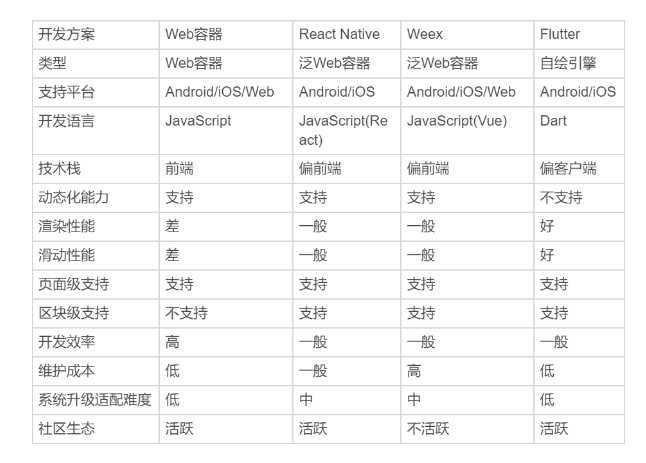

## 01 Fultter工程环境搭建

内容较长，单独放到了一个文件 “Flutter环境搭建踩坑之旅”。Android Studio的windows安装有大量的坑。

## 02 Dart语言概述

2011年，由 Google 发布。Dart 的最初定位也是一种运行在浏览器中的脚本语言。为了推广 Dart，Google 在 Chrome 浏览器内置了 Dart VM，可以直接高效地运行 Dart 代码，同时提供一套将 Dart 代码编译成 JS 代码的转换工具。

2015年，Dart VM 引擎从 Chrome 移除。同年5月，Google 推出以 Dart 作为开发语言的移动开发框架Flutter。

### JIT & AOT

Dart 同时支持 JIT（Just In Time，即时编译）和 AOT（Ahead of Time，运行前编译）。

- JIT，开发周期中可以动态下发和执行代码，开发测试效率高。如热重载就基于此。
- AOT，发布期使用AOT直接生成二进制代码，运行速度快、执行性能好。

### 内存分配 & 垃圾回收

Dart VM内存分配策略，创建对象只在堆上移动指针，内存增长时钟是线性的。

Dart 并发通过 Isolate实现。Isolate类似于线程但不共享内存，是独立运行的worker。可实现无锁快速分配。

Dart 垃圾回收采用多生代算法。新生代采用 半空间 机制，只操作少量 活跃 对象。适合Flutter框架中大量Widget销毁重建的场景。

### 单线程模型

Dart 中没有现成，只有 Isolate。Isolate 像几个运行在不同进程中的 worker，通过事件循环在事件队列上传递消息通信。

### 无需单独的声明式布局语言

Flutter 中，界面布局直接通过Dart编码定义。❓❓ 没看懂这个特点

## 03 跨平台方案发展

### Web容器时代

基于 web 相关技术，通过浏览器组件来实现界面及功能，典型框架包括 Cordova、Ionic 和微信小程序。

原生应用内嵌浏览器控件 WebView，进行 H5 页面渲染。通过 JS Bridge 将部分原生系统能力暴露给 H5 ，如定位、音视频、相册/相机、传感器...

- 优势：生态繁荣、开发体验友好、生产效率高、跨平台兼容性强。
- 问题：Web 容器过于笨重，以至于性能和体验都达不到与原生同样的水准。

### 泛Web容器时代

采用类 web 标准进行开发，运行时把绘制和渲染交由原生系统接管的技术，代表框架React Native、Weex、Virtual View。

采用JS开发，通过Bridge连接原生渲染组件和系统能力。控件渲染由原生组件完成简化渲染过程同时保证良好的渲染性能。

- 优势：解决了web容器带来的性能问题。
- 问题：Follow Native的思维方式，框架需要大量平台相关的逻辑，不同平台原生控件渲染能力差异导致大量bug。

### 自绘引擎时代

自带渲染引擎，客户端仅提供一块画布即可获得从业务逻辑到功能呈现的多端高度一致的渲染体验。代表框架Flutter。

不依赖于原生控件，自绘组件完成系统绘制和事件。通过平台插件获取原生系统能力。

代表Fultter：

- 渲染引擎，依靠跨平台的Skia图形库实现，Skia引擎将使用Dart构建的抽象视图结构数据加工成GPU数据，叫有OpenGL最终提供给GPU渲染。

- Dart语言同时支持JIT和AOP，保证开发效率同时，提升执行效率。

### 跨平台方案对比



### Flutter动态化问题

动态化，是指代码逻辑放在云端，以下发的法师更新应用程序原本功能的方式，是不依赖于程序安装包的更新，就能进行动态实时更新页面的技术。可以理解成游戏下载新的关卡。

Flutter确实不支持动态化，根据具体需求有两个解法：

1. 把你们需要动态变更的模块全部组件化，修改前后端通信协议让服务器可以动态的配置页面模块。
2. 业界已经有一些通过JSCore实现Flutter动态布局的实践。

## 04 Flutter关键技术

Flutter 是构建 Google 物联网操作系统 Fuchsia 的 SDK，主打跨平台、高保真、高性能

### Flutter绘制原理

1. UI线程使用Dart构建视图结构数据；
2. 这些数据在GPU线程进行图层合成；
3. 交给Skia引擎加工成GPU数据；
4. 通过OpenGL最终提供给GPU渲染。

OpenGL是skia的渲染后端，主要用于GPU硬件加速。

### Skia

一款用 C++ 开发的、性能彪悍的 2D 图像（图形转换、文字渲染、位图渲染）绘制引擎。

Skia 保证了同一套代码调用在 Android 和 iOS 平台上的渲染效果是完全一致的。

### Flutter架构

从下到上分为三层，Embedder、Engine、Framework。

- Embedder 是操作系统适配层，实现了渲染 Surface 设置、线程设置，以及平台插件等平台相关特性的适配。
- Engine 主要包含 Skia、Dart、Text，实现 Flutter 的渲染引擎、文字排版、事件处理和Dart运行是等功能。
- Framework 是一个用 Dart 实现的 UI SDK，包含动画、图形绘制和手势识别等功能。根据 Material 和 Cupertino 两种设计风格封装了一套UI组件库。

### 界面渲染过程

页面的界面元素widget组成控件树。每个空间创建不同类型的渲染对象，组成渲染对象树。

渲染对象树的展示过程：

1. 布局：深度优先机制遍历，决定渲染对象位置和尺寸；布局边界机制控制重新布局影响范围。
2. 绘制：布局后按深度优选机制，将所有渲染对象绘制到不同的图层；重绘边界机制避免无关内容置于统一图层引起不必要的重绘。
3. 合成：将所有图层根据大小、层级、透明度等规则计算最终显示效果，将相同的图层归类合并，简化渲染树。
4. 渲染：将合成后的几何图层数据交由Skia引擎加工成二维图像数据，最后由GPU渲染。

## 05 Flutter如何运行在原生系统

Flutter工程是一个同事内嵌了 Android 和 iOS 原生子工程的父工程。Flutter将相关的依赖和构建产物注入这两个子工程，最终集成到各自的项目中。开发的代码，最终以原生工程形式运行。

Flutter是从上至下的有自己的UI渲染的闭环。最终程序运行是以原生的方式进行的。Flutter程序的运行方式最终会打包成Android/iOS平台特定的格式：Android会把Flutter画布打包成FlutterView，iOS则会打包成FlutterViewController。

```
D:\wmhjm\flutter_app
├── android             -包含android特定文件的android子工程
├── build               -android和iOS的构建产物
├── flutterapp.iml      -工程配置文件
├── ios                 -包含iOS特定文件的iOS子工程
├── lib
|  └── main.dart        -程序入口文件
├── pubspec.lock        -记录当前项目实际依赖信息的文件
├── pubspec.yaml        -管理第三方库及资源的配置文件
├── README.md
└── test                -测试文件
```

### 工程代码

应用模板， main.dart

```dart
import 'package:flutter/material.dart';

void main() => runApp(MyApp());

class MyApp extends StatelessWidget {
    @override
    Widget build(BuildContenxt context) => MaterialApp(home: MyHomePage(title: 'Flutter Demo Home Page'));
}

class MyHomePage extends StatefulWidget {
    MyHomePage({Key key, this.title}): super(key: key);
    final String title;
    @override
    _MyHomePageState createState() => _MyHomePageState();
}

class _MyHomePageState extends State<MyHomePage> {
    int _counter = 0;
    void _incrementCounter() => setState(() {_counter++;});
    @override
    Widget build(BuildContext context) {
        return Scaffold(
            appBar: AppBar(title: Text(Widget.title)),
            body: Text('You have pushed the button this many times:$_counter'),
            floatingActionButton: FloatingActionButton(onPressed: _incrementCouter)
        );
    }
}
```

- Widget：应用、视图、视图控制器、布局等都建立在Widget之上。Widget 的 build 方法用于告诉 Flutter 框架如何构建 UI界面，可在其中对基础 Widget 进行相应的 UI 配置。
- StatelessWidget：无状态的Widget。有build方法返回Widget。
- StatefulWidget：有状态的Widget。无build方法。使用createState方法返回_MyHomePageState对象，通过State创建Widget，以数据驱动视图更新，不直接操作UI更新视觉属性。
- MaterialApp类：对构建 material 设计风格应用的组件封装框架，可配置应用主题、名称、语言标识符、路由等。
- Widget Scaffold：Material库中提供的页面布局结构。
- setState方法：Flutter以数据驱动视图的关键函数。调用该方法，Flutter会在底层标记Widget的状态，随后触发重建。

Widget只是视图的 配置信息，是数据的映射，只读。StatefulWidget 数据改变时，需要重新创建Widget去更新界面，Widget的创建销毁会非常频繁。

Widget只是一个轻量级的数据配置存储结构，不负责渲染。所以即使销毁重建也不影响真实的渲染树。buildContext是Widget对应的Element，负责实际渲染的。

Flutter框架内部通过一个中间层去收敛上层UI配置对底层真实渲染的改动，计算diff判断真正需要刷新的那部分，降低对真实渲染视图的修改，避免上层UI配置变了无需销毁整个渲染视图树。

## 06 Dart基础语法与类型变量

Dart 中使用 var 定义变量时，表示类型是交由编译器推断决定的。在默认情况下，未初始化的变量的值都是 null。

Dart 是类型安全的语言，所有类型都是对象类型，继承自顶层类型 Object，一切变量的值都是类的实例。

### num、bool、String

num 数值类型，两种子类init 、double。基本运算符 + 、- 、* 、/、%、~/、<=、>=、==、abs()、round()。dart:math库提供了三角函数、指数、对数、平方根等高级函数。

bool 布尔类型，true false，都是编译时常量。不能使用 if (nonbooleanValue) 隐私类型转换判断，必须显示的比较，因为Dart是类型安全的。

String 字符串类型，可以使用${ express }在字符串中嵌入变量或表达式，如果只有一个标识符 {} 可省略。

### List、Map

对应于其他语言的数组和字典。

```dart
var arr1 = [1, 2, 3];
var arr2 = List.of(['h', 'j', 'm']); // 这写的有问题吧❓❓ 都是数组了还要去List.of一下
arr1.add('h'); // Error，Dart会根据上下文进行类型推荐List<int>，不能添加String 或 double等非init 类型数据
arr2.forEach((v) => print(v)); // 单个参数也不可省略括号
// 为语言清晰，可增加类型约束
var arr1 = <String>['h', 'j', 'm'];
var arr2 = new List<int>.of([1, 2, 3]);
arr2.add(499);
print(arr2 is List<int>); // true
```

```dart
var map1 = {"name": "Tom", 'sex': 'male'}; 
var map2 = new Map();
map2['name'] = 'Tom';
map2['sex'] = 'male';
map2.forEach((k,v) => print('${k}: ${v}'));
// 为语言清晰，可增加类型约束
var map1 = {'name': 'Tom','sex': 'male',};
var map2 = new Map();map2['name'] = 'Tom';map2['sex'] = 'male';
map2.forEach((k,v) => print('${k}: ${v}')); 
print(map2 is Map); // true
```

可以使用 List<num, String> 等使 List 支持多种类型内部元素，不建议使用 List<dynamic>。遍历集合时，可通过 is 判断可枚举类型，也可以通过 runtimeType 判断类型。

List 指定 length 后，默认数值都为null ，这是由于未初始化的变量都是 null特性，并且这时候可以在安全下标内进行赋值。但是不指定 length 的 List 则无法指定下标赋值，因为超出了下标边界。

### 常量

const，编译期常量。final，运行是常量。

```dart
const count = 2; // const 必须直接赋值一个字面量
var x = 20;
var y = 30;
final z = x / y; // final 可以赋值一个字面量 或变量 或公式，但是一旦赋值不能改变
```

## 07 函数、类、运算符

### 函数

函数也是对象，类型 Function。

```dart
bool isZero(int number) {
	return number == 0;
}
bool isZero(int number) => number == 0;
// 定义可选命名参数，增加默认值
void enable({bool bold, bool hidden = false}) => print();
// 定义可忽略参数
void enable(bool bold, [bool hidden = false], [bool lg]) => print();
```

### 类

Dart没有public、protected、private等关键字。变量与方法前加 ‘_’ 即可作为private使用，限制范围是库访问级别，而非类访问级别。

Dart提供了 命名构造函数 和 初始化列表 两种初始化方式。

- 命名构造函数就是给构造函数起了个名字，使用"类名.构造函数名"的方式初始化实例。
- 初始化列表是在构造函数体外，对变量进行批量赋值的机制，不仅简洁，代码执行性能也更优。

```dart
class Point { 
    num x, y, z; 
    Point(this.x, this.y) : z = 0; // 初始化变量z，构造函数体执行之前初始化实例变量
    Point.bottom(num x) : this(x, 0); // 重定向构造函数 
    void printInfo() => print('($x,$y,$z)');
}
void main() {
    var p = Point.bottom(100);
    p.printInfo(); // 输出(100,0,0)
}
```

复用

- 继承：extends 子类由父类派生，自动获取父类的成员变量和方法实现。子类根据需要覆写构造函数及父类方法。
- 接口：implements 子类获取接口的成员变量符号和方法符号，需要重新实现成员变量和方法，否则会报错。
- 混入：with 以非继承的方式使用其他类中的变量与方法。

```dart
class Point {
    num x = 0, y = 0;
    void printInfo() => print('$x $y');
}

class Vector extends Point {
    num z = 0;
    @override
    void printInfo() => print('$x $y $z');
}

class Coordinate implements Point {
    num x = 1, y = 1;
    void printInfo() => print('coordinate is $x $y');
}
```
### 运算符

除常规运算符外，Dart增加了几个额外的运算符，用于简化处理变量实例缺失（即为null）的情况。

- ?. 成员方法属性调用，如 p?.printInfo()。
- ??= 变量为null才赋值，如 a ??= 1。
- ?? 如果a不为null返回a，否则返回b，如 a ?? b。

Dart提供了类似C++的运算符覆写机制。

```dart
class Vector {
    num x, y;
    Vector(this.x, this.y);
    Vector operator +(Vector v) => Vector(x + v.x, y + v.y); // 向量相加
    bool operator == (dynamic v) => x == v.x && y == v.y;    // 判断向量相等
}

final x = Vector(3, 3);
final y = Vector(2, 2);
final z = Vector(1, 1);
print(x == (y + z));    // true
```

## 09 Widget、Element、RenderObject

Flutter 把视图数据的组织和渲染抽象为三部分，Widget、Element、RenderObject。

渲染过程

1. 遍历Widget树生成对应的Element树。
2. 创建相应的RenderObject并关联到Element.renderObject属性上。
3. 构建成RenderObject树（布局和绘制）。
4. 合成和渲染有Skia搞定。在 VSync 信号同步时直接从渲染树合成 Bitmap，然后提交给 GPU。

### Widget

Widget 是控件实现的基本逻辑单位，存储视图渲染的配置信息，包括布局、渲染属性、事件响应信息等。

Widget具有不可变性，当视图渲染的配置信息变化是，会重建Widget树进行数据更新。

Widget 的配置数据发生了改变，那么持有该 Widget 的 Element 节点也会被标记为 dirty。在下一个周期的绘制时，Flutter 就会触发 Element 树的更新，并使用最新的 Widget 数据更新自身以及关联的 RenderObject 对象，接下来便会进入 Layout 和 Paint 的流程。

### Element

Element是Widget的一个实例化对象，是可变的。Element树将Widget树的变化做了抽象，只将真正修改的部分同步到RenderObject树，最大程度降低对真实渲染视图的修改。

### RenderObject

RenderObject 是主要负责实现视图渲染的对象，布局和绘制在RenderObject中完成。

RenderObjectWidget，一个抽象类，拥有createElement、createRenderObject、updateRenderObject方法。是渲染的起点（对象的载体），自己不负责他们的创建和更新，但是提供了创建和更新的方法让框架在合适的时机调用。❓❓ 抽象类不是一种类似接口的概念吗？

RenderObjectElement，RenderObject 的创建与更新，其实是在 RenderObjectElement 类中完成的。

## 10 StatelessWidget、StatefulWidget

Flutter 的视图开发是声明式的，其核心设计思想就是将视图和数据分离。与Vue、React设计思路类似。

命令式编程强调精确控制过程细节，声明式编程强调通过意图输出结果整体。

### StatelessWidget

Widget 采用由父到子、自顶向下的方式进行构建。

父 Widget 能通过初始化参数完全控制其 UI 展示效果，就可以使用 StatelessWidget 来设计构造函数接口。如自定义的弹框控件，可使用StatelessWidget。

### StatefulWidget

通过 createState 方法创建了一个指定类型 的 state 对象，然后由这个对象负责视图的构建。State 对象通过  方法监听到属性发生了变化，立即调用 setState 方法通知 Flutter 框架。

StatefulWidget 的滥用会直接影响 Flutter 应用的渲染性能。在 State 类中调用 setState 方法更新数据，会触发视图的销毁和重建，也将间接地触发其每个子 Widget 的销毁和重建。即使不去主动setState，对于Stateful在特定的时机也会rebuild的。

有人用 StatelessWidget + Provide 能取代一部分 StatefulWidget 的功能

```dart
 const Image({
    Key key, 
    @required this.image,
    // 其他参数
  }) : assert(image != null),
       super(key: key);
// 1.key用在Element复用过程中，控制控件如何取代树中的另一个控件。比如你在父Widget用新的image重建了Image，底层Element还是能复用的。
// 2.assert是断言，只在debug中生效。
```

