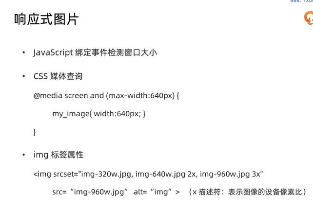
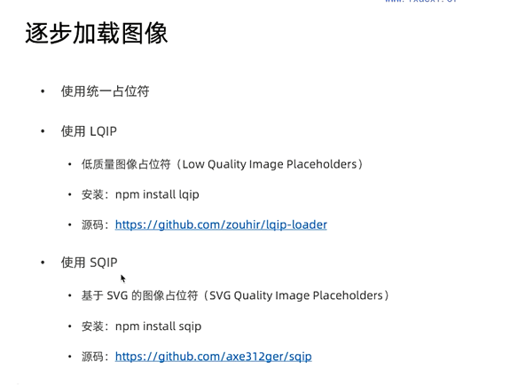
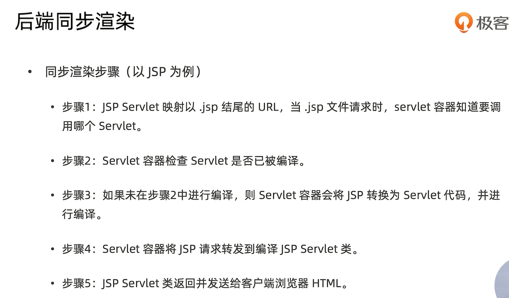
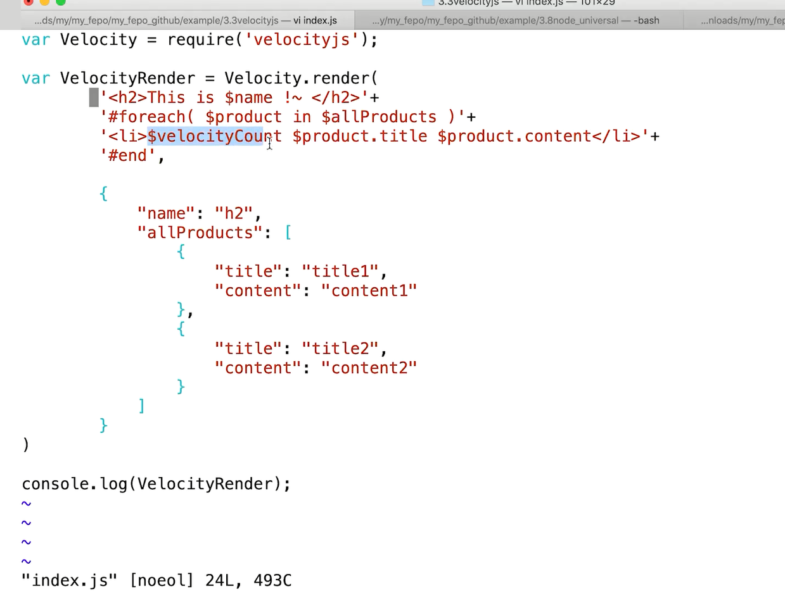
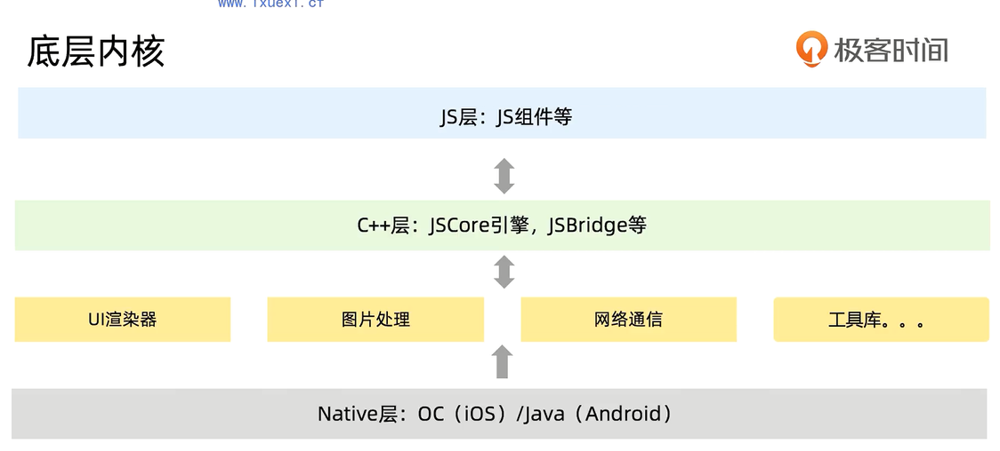
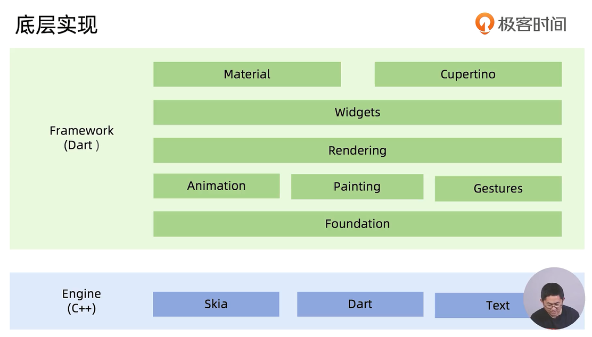
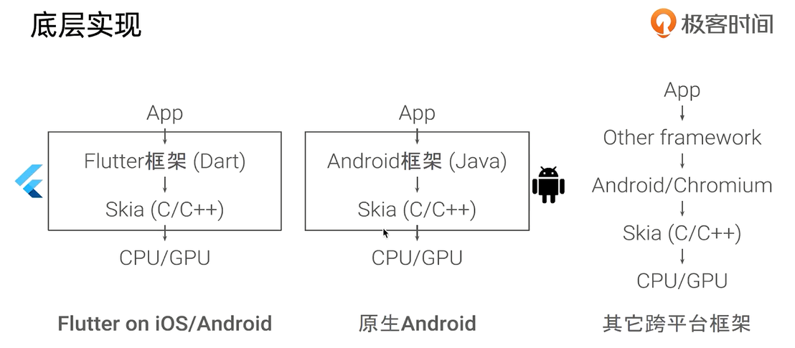

## 静态资源优化

### 一、图片优化

#### 1.图片格式

（1）JPEG 

- 有损压缩图形格式（栅格图形），不支持透明度
- 不适合线条图形和文字、图标
- 适合颜色丰富的照片

（2）PNG

- 无损压缩的位图图形格式（栅格图形），支持索引、灰度、RGB三种颜色方案以及Alpha通道
- 不适合无损存储的彩色图像（体积太大）
- 适合纯色或线条图形

（3）GIF

- 才有LZW压缩算法进行编码的位图图形文件，仅支持完全透明和完全不透明
- 每个像素只有8比特，不适合存储彩色图片
- 适合动画、图标

#### 2.图片加载优化

（1） JPG

```
jpegtran
npm install -g jpegtran
jpegtran -copy none -optimize -outfile out.jpg in.jpg
```

（2）PNG

```
// npm install node-pngquant-native 压缩比高，适合PNG24
const pngquant = require('jdg-png-native');
const fs = require('fs');
fs.readfile('./in.png', (err, buffer) => {
	if(err) throw err;
	const quantBuffer = pngquant.option({}).compress(buffer);
	fs.writefile('./out.png', quantBuffer, () => {});
});
```

（3）GIF

```
gifsicle
gifsicle --optimize=3 -o out.gif in.gif
gifsicle --optimize=3 --crop-transparency -o out.gif in.gif
```

http://www.lcdf.org/gifsicle

（4）其他图片优化

- 响应式图片

- 逐步加载图形（低质量占位符）

- 使用字体图标代替图片

- data URI代替图片

- image spriting 雪碧图

  
  
  

### 二、HTML优化

1.精简HTML代码

- 减少HTML的嵌套
- 减少DOM节点数

2.文件放在合适的位置

- CSS放在头部
- JS放在结尾

3.增强用户体验

- 设置favicon.ico
- 增加首屏的CSS和JS

### 三、CSS优化

1.提升CSS渲染性能

- 谨慎使用nth-child伪类、fixed定位
- 尽量减少样式层级数
- 尽量避免使用占用过多CPU和内存的属性，如text-indent: -9999px
- 尽量避免使用耗电量大的属性，如 transforms / transitions / opacity
- 尽量避免使用CSS表达式
- 尽量避免使用通配符选择器

2.提升CSS文件加载性能

- 使用外链CSS
- 尽量避免使用@import

3.精简CSS代码

- 使用缩写语句
- 删除不必要的0和px

4.合理使用web fonts

- 将字体部署在CDN上

5.CSS动画优化

- 尽量避免同时动画
- 延迟动画初始化
- 结合SVG

### 四、JS优化

1.变量和函数优化

- 尽量使用id选择器
- 代码简洁
- 节流和防抖
- 事件委托

2.JS动画优化

-  避免大量JS动画
- 尽量使用CSS动画、Canvas动画
- 合理使用requestAnimationFrame动画代替setTimeout、setInterval

3.合理使用缓存 

### 五、静态文件压缩工具

- html-minifier
- clean-css
- uglify-js

## 页面渲染优化

- 后端同步渲染
- 页面静态化
- 前后端分离
- 单页应用
- BigPipe
- 同构直出 next.js / nuxt.js
- PWA





## 原生APP优化

### ReactiveNative



### Flutter





## 服务端和网络优化

## 全链路质量监测体系