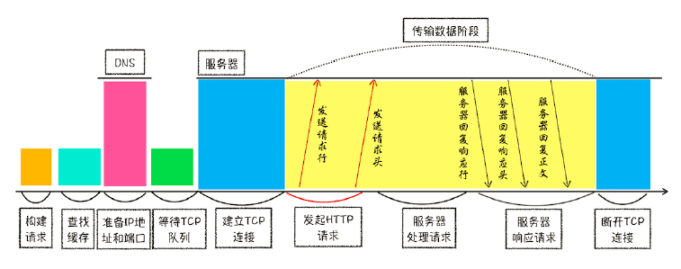
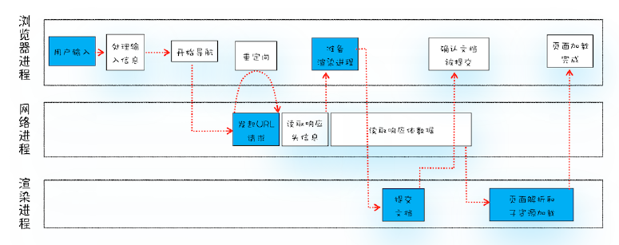
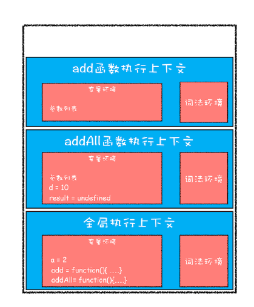
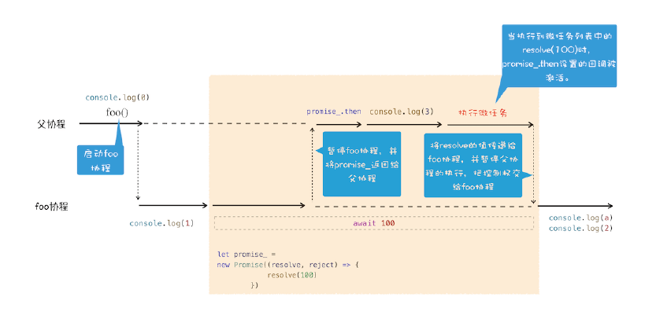
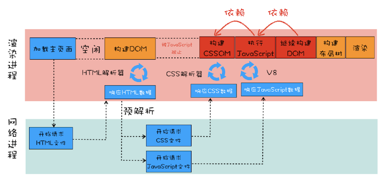

## 01 开篇

### 浏览器三大进化路线

1. 应用程序Web化：浏览器/服务器（B/S）架构应用，如视频、音频、游戏。
2. Web应用移动化：PWA（解决 性能不及原生应用、离线用户无法使用、无法接收消息推送、没有移动端入口）。
3. Web操作系统化：利用web技术构建纯粹的操作系统，如ChromeOS；浏览器底层结构往操作系统架构发展。

### 前端核心诉求演进

1. 脚本执行速度：ES6 >> 7 >> 8、WebAssembly。
2. 前端模块化开发：WebComponents。
3. 渲染效率：Chrome的下一代布局方案LayoutNG，渲染方案Slim Paint。

### 目标

1. 评估Web开发项目的可行性
2. 从浏览器原理的高度来审视页面
3. 在快速的技术迭代中把握本质

### 相关扩展

#### WebAssembly

assembly程序集。

一种技术方案，使用非JS编程语言编写代码并能在浏览器运行。

使用C、C++、Rust编写代码，使用LLVM（编译器工具链）编译成.wasm文件（可在JS中加载使用）。

##### JS解释器和编译器

将JS代码翻译成机器语言。

1. 解释器：翻译过程是一行一行进行的，执行到哪行，翻译哪行。
2. 编译器：执行前翻译。

##### 监视器

JS引擎的一部分。在JS运行时监控代码，记录代码片段运行的次数以及使用的数据类型。运行几次的被标记为"warm"，交由基础编译器（小幅提速）；运行很多次的被标记为"hot"，交给优化编译器（大幅提速）。

##### JS vs WebAssembly

JS：download >>> parse >>> compile + optimize >>> re-optimize >>> execute >>> garbage collection

WebAssembly：download >>> parse >>> compile + optimize >>> execute 

1. download：相同功能，WebAssembly文件比JS文件小。
2. parse：JS源码先被解析为抽象语法树，然后需要的代码被转换为字节码，不需要的被创建存根。WebAssembly是字节码，只需要被解析并确定有没有错误。
3. compile + optimize：JS动态类型语言，执行期间编译，相同代码多次执行可能因数据类型不同被重新编译。而WebAssembly字节码不需要在运行时判定数据类型。
4. re-optimize：JS代码基于运行时的假设不正确是，会重新优化。WebAssembly类型明确不需要重新优化。
5. execute：WebAssembly为编译器设计，提供更适合机器的指令，运行速度更快。
6. garbage collection：JS引擎使用垃圾回收器自动进行垃圾回收（无法控制时机）。WebAssembly不支持垃圾回收，内存需要手动管理。

## 02 1个页面4个进程

### 进程  & 线程

#### 进程

一个进程就是一个程序运行实例。

启动一个程序时，操作系统会为该程序创建一块内存，用来存放代码、运行中的数据、一个执行任务的主线程，这样的一个运行环境叫进程。

#### 线程

线程不能单独存在，必须由进程来启动和管理。多线程可以并行处理任务。

#### 关系

1. 进程中任一线程执行出错，都会导致整个进程的崩溃。
2. 线程之间共享进程中的数据。
3. 当进程被关闭时，操作系统会回收进程所占用的内存。即使进程中的任意线程内存泄露，这些内存也会被正确回收。
4. 进程之间的内容相互隔离。进程间的通信依赖IPC机制。

### 进程 & 浏览器

#### 单进程浏览器

2007年之前，大部分浏览器都是单进程的。网络、插件、JS运行环境、渲染引擎等所有功能模块运行在同一进程里。

##### 单进程浏览器的问题

1. 不稳定：视频、游戏等插件崩溃，复杂JS代码引起渲染引擎崩溃，会进一步导致整个浏览器崩溃。
2. 不流畅：所有模块运行在同一线程中，脚本或插件可能会导致页面内存泄露，让浏览器卡顿。
3. 不安全：使用C、C++编写的插件可以获取操作系统的任何资源，脚本也可以通过浏览器漏洞获取系统权限，引发安全问题。

#### 多进程浏览器

最新Chrome浏览器，包括 1个浏览器主进程、1个GPU进程、1个网络进程、多个渲染进程和多个插件进程。

1. 浏览器主进程：界面展示、用户交互、子进程管理、存储功能。
2. GPU进程：UI、3D效果。
3. 网络进程：网络资源加载。
4. 渲染进程：HTML+CSS+JS >>> 交互网页，排版引擎Blink、JS引擎V8在里面运行。sandbox
5. 插件进程：插件运行。部分系统支持sandbox。

##### 多进程浏览器的问题

1. 更高的资源占有：每个进程都会包含公共基础结构的副本，消耗跟多的内存资源。
2. 更复杂的体系架构：各模块之间的耦合性高、扩展性差，很难适应新的需求。

#### 面向服务的架构（未来）

2016年，Chrome使用 Services Oriented ArchItecture（SOA）的思想设计了新的Chrome架构。

功能模块 >>> 独立的服务（运行在独立的进程中），访问服务需使用定义好的接口通过IPC通信。✔高内聚、松耦合、易维护扩展

##### 基础服务

- Profile进程
- UI进程
- GPU进程
- 网络进程
- 文件进程
- 设备进程
- Audio进程
- Video进程
- ...

基础服务类似于操作系统底层服务，上层才是 浏览器主进程、渲染进程、插件进程。

在资源不足的设备是哪个，可以将基础服务合并到浏览器主进程。

## 03 TCP 完整传输

### 网络层（IP）

将数据包送达目标主机。

网络层，在数据包上 附加IP头（解析IP头）。（源、目标IP地址）

### 传输层

把数据包送达应用程序。添加或解析UDP头。（源、目标端口号）

#### UDP

User Datagram Protocol 用户数据包协议

#### TCP

Transmission Control Protocol，传输控制协议。

建立连接、传输数据（接收端对每个数据包进行确认）、断开连接，保证数据完整传输。

## 04 HTTP请求流程

### （1）构建请求

构建请求行信息，准备发起网络请求。

### （2）查询缓存

浏览器缓存包括disk cache、memory cache、service worker cache，查询缓存失败才会进入网络请求。

### （3）准备IP地址和端口

DNS解析域名返回IP（DNS数据缓存服务）。端口从URL中取，没有使用默认的80或443。

### （4）等待TCP队列

chrome 同一域名同时最多只能建立6个TCP连接，超出的进入排队等待状态。（图片等静态资源多使用CDN）

### （5）建立TCP连接

### （6）发送HTTP请求

### （7）服务器处理请求

### （8）服务器响应请求

### （9）断开TCP连接



## 05 从输入URL到页面展示



### （1）用户输入

地址栏根据用户输入的内容生成完整的URL。

地址栏会判断输入的关键字是搜索内容还是请求URL，如果是搜索内容则使用默认的搜索引擎合成新的带搜索关键字的URL，如果是URL则完整化处理。

按下回车键后，标签栏小图标的地方显示loading状态。页面底部会显示 正在等待 xxx.xx.xx的响应。

### （2）URL请求过程

1. 浏览器主进程通过IPC把URL请求发送到网络进程；

2. 网络进程收到URL后，查询本地缓存，有返回，没有进入网络请求流程；

3. DNS解析、建立TCP连接、发送HTTP请求、服务端处理请求返回数据（断开连接）；

4. 网络进程收到响应，开始解析响应头，

   发现状态码301或302就读取Location字段重定向（重头开始），200就继续处理请求，

   Content-Type值为stream之类的就把请求交给浏览器的下载管理器结束，是html就继续。

### （3）准备渲染进程

一般chrome会为每一个页面分配一个渲染进程。但如果从A页面打开B页面，A/B页面属于同一站点（域名协议相同），那B页面会复用A页面的渲染进程。

#### 附：

我觉得这个时候，开始求证

### （4）提交文档

1. 浏览器主进程发"提交文档"的消息给渲染进程；
2. 渲染进程收到消息后和网络进程加你传输数据的管道；
3. 文档数据传输完成，渲染进程返回"确认提交"的消息给浏览器主进程；
4. 浏览器主进程更新界面状态，包括安全状态、地址栏URL、更新前进后退历史状态、web页面。（这个时候才卸载当前页，回收内存❓❓）

### （5）渲染阶段

1. 渲染进程开始页面解析，子资源加载；
2. 页面渲染完成，渲染进程发消息，浏览器主进程收到后停止标签图标上的加载动画。

## 06 渲染流程

### （1）构建DOM树

浏览器无法直接理解和使用HTML，需要将HTML转换为浏览器可以理解的结构--DOM树。

### （2）样式计算

1. 将CSS文本，转换为styleSheets，标准化样式表中的属性值（计算值）；
2. 按继承规则、层叠规则计算出节点具体样式，保存在ComputedStyle中。

### （3）布局阶段

1. 根据DOM树和ComputedStype生成布局树（所有可见节点）；
2. 计算布局树节点的坐标位置；
3. 执行布局操作：将布局计算的结果重新协会布局树。

### （4）分层

3D变换、页面滚动、z-index排序等效果，渲染引擎需要为这些特定的节点生成专用的图层，生成对应的图层树。

- 拥有层叠上下文属性的元素会被提升为单独的一层，如filter、opacity、z-index、fixed...
- 需要裁剪 (clip) 的地方会被创建为图层。如200x200的带滚动条的div分为三层，文字层、滚动条、容器层

### （5）图层绘制

绘制图层树的每个图层，把一个图层的绘制拆分成多个绘图指令，输出待绘制列表。

### （6）格栅化（raster）操作

1. 渲染进程的主线程吧绘制列表提交给合成线程；
2. 合成线程将图层划分为图块（tile），256x256或512x512；
3. 合成线程按视口附近的图块优先生成位图，渲染进程维护一个格栅化（图块>>位图）的线程池，完成所有图块格栅化；
4. 格栅化过程都会使用GPU加速，渲染进程IPC将生成位图的指令发给GPU线程，GPU生成的位图并保存在GPU内存中。

### （7）合成和显示

1. 所有图块格栅化完毕，合成线程生成绘制图块的指令"DrawQuad"提交到浏览器主进程；
2. 浏览器主进程的viz组件接受指令，根据指令将页面内容绘制到内存中，再将内存显示在屏幕上。

**DOM >> Style >> Layout >> layer > Paint(sheet)   >> ** （主线程）CPU

**tiles >> raster >> draw quad >> display** （合成线程、GPU进程、浏览器主进程）GPU

### 重排

更新元素的几何属性，如改变元素宽高等，浏览器会触发重新布局，触发后面整个的渲染流水线更新，开销大。

 Layout >> layer > Paint(sheet) >> tiles >> raster >> draw quad >> display

### 重绘

更新元素的绘制属性，如改变背景色等，没有几何位置变化，因此跳过布局阶段直接进入绘制阶段，更新后续流程，执行效率比重排高。

 Paint(sheet) >> tiles >> raster >> draw quad >> display

### 合成

更改不需要布局、绘制的属性，直接进入合成阶段，如transform实现动画效果，执行效率比重绘高。

tiles >> raster >> draw quad >> display

### 附：

#### 让人眼前一亮的chrome开发工具操作

##### 选择元素

开启选择模式：点击调试面板左上角的按钮开启（或ctrl+shift+c）。这样鼠标hover即可预览当前元素，左键单击可以选中元素。不过比较鸡肋的是，右键单击后就退出了选择模式，需要重新开启，体验和惊艳度下降50%。

##### 样式属性值

单击选中样式属性的值后， up/down 加/减1，alt + up/down 加减0.1，shift + up/down 加减10

## 07 变量提升

## 08 调用栈

### 编译执行

1. 当JS执行全局代码时，会编译全局代码并创建全局执行上下文。
2. 当调用一个函数时，函数体内部的代码会被编译，创建函数执行上下文。一般函数执行结束之后，创建的函数执行上下文会被销毁。
3. eval函数（执行时么？）的代码也会被编译，并创建执行上下文。

console.trace() 输出当前函数调用关系。

```js
var a = 2
function add(b,c){
    return b+c
}
function addAll(b,c){
    var d = 10
    result = add(b,c)
    return a+result+d
}
addAll(3,6)
```



## 09 块级作用域

解决变量提升、变量覆盖、变量污染等JS设计缺陷。

### 作用域

指程序中定义变量的区域，该位置决定了变量的生命周期。通俗讲，作用域就是变量与函数的可访问范围，即作用域控制着变量和函数的可见性和生命周期。

#### 全局作用域

在代码中的任何地方都能访问，其生命周期伴随着页面的生命周期。

#### 函数作用域

在函数内部定义的变量或函数，定义的变量和函数只能在函数内部被访问。函数执行结束之后，函数内部定义的变量会被销毁。

#### 块级作用域

使用一对大括号包裹的一段代码。

JS将块级作用域放到词法环境。（编译阶段，let const声明的变量放到词法环境，而var声明的变量放到变量环境中的。）


## 10 作用域链和闭包

词法作用域是指作用域是由代码中函数声明的位置来决定的，是静态作用域，与函数调用无关。

### 闭包

在 JavaScript 中，根据词法作用域的规则，内部函数总是可以访问其外部函数中声明的变量，当通过调用一个外部函数返回一个内部函数后，即使该外部函数已经执行结束了，但是内部函数引用外部函数的变量依然保存在内存中，我们就把这些变量的集合称为闭包。比如外部函数是 foo，那么这些变量的集合就称为 foo 函数的闭包。

## 11 this

this与作用域链基本无关。每个执行上下文中都有一个this。

1. 函数被正常调用时，函数中的this指向window，严格模式下this是undefined；
2. 函数作为对象的方法调用时，函数中的this就是该对象；
3. 可以使用call、apply、bind方法显式设置函数执行上下文的this；
4. 嵌套函数中this不会继承外层函数的this值（解决方案：self保存外层this 或 箭头函数）；
5. 被setTimeout推迟执行的回调函数是某个对象的方法，那么该方法中的this关键字指向window；
6. 构造函数的this指向新对象。

## 12 栈空间和堆空间

### 语言类型

- 静态语言：在使用之前需要确定变量数据类型的语言。C、C++、Java
- 动态语言：在运行过程中需要检查数据类型的语言。JS、PHP、Python、Ruby、VB
- 弱类型语言：支持隐式类型转换的语言。C、C++、JS、PHP、VB
- 强类型语言：不支持隐式类型转换的语言。Java、Ruby、Python

### 栈

原始类型的数据存放在栈中。（变量名：变量值）（a: 1）（user: 1003）

### 堆

引用类型的数据存放在堆中。 （地址：值）（1003: { name: 'jkb', age: 2 } ）

### 再谈闭包

编译过程中，遇到内部函数应用外部函数的变量，JS引擎判断是一个闭包，会在堆空间创建一个内部对象 "closure(foo)" ，将用到的变量保存在"closure(foo)"中。

## 13 垃圾回收

C、C++：使用手动回收策略，何时分配内存、何时销毁内存都是有代码控制的。

Javascript、Java、Python：使用垃圾回收器来释放产生的垃圾数据。

### 调用栈的数据回收

函数执行结束之后，JS引擎通过向下移动ESP（记录当前执行状态的指针）来销毁该函数保存在栈中的执行上下文。当新的函数执行上下文入栈时，直接覆盖原来的执行上下文。

### 堆中数据回收

函数执行完毕，栈内存释放。但是函数中对象使用的堆空间仍未释放，这就需要JS的垃圾回收器。

### V8

#### 两个堆的区域

- 新生代：存放的是生存时间短的对象，容量1~8M。
- 老生代：存放生存时间久的对象。

#### 两种垃圾回收器

- 副垃圾回收器：主要负责新生代的垃圾回收。
- 主垃圾回收器：主要负责老生代的垃圾回收。

#### 共同执行流程

1. 标记空间中活动对象和非活动对象。活动对象是还在使用的对象，非活动对象是可以进行垃圾回收的对象。
2. 回收非活动对象占据的内存。即在标记完成后，统一清理内存中被标记为可回收的对象。
3. 内存整理。频繁回收对象后，会存在大量不连续空间--内存碎片，最后一步需要整理这些内存碎片。（主垃圾回收器）

#### 副垃圾回收器

新生代使用scavenge算法，将空间对半划分为对象区域、空闲区域。新加入的对象都存放在对象区域，对象区域写满时，开始一次垃圾清理操作。

1. 给对象区域中的垃圾做标记，标记完成后进入垃圾清理阶段；
2. 副垃圾回收器将存活的对象复制到空闲区域，并把它们有序的排列起来（无内存碎片）；
3. 复制完成后，对象区域和空闲区域进行角色反转；
4. 如果经过两次垃圾回收依然还存活的对象，会被移动到老生区。

#### 主垃圾回收器

老生区中对象的特点：占用空间大、存活时间长。

标记-清除算法（Mark - Sweep）

1. 垃圾标记过程：从一组根元素开始，遍历，能到达的称为活动对象，没有达到的判为垃圾数据。
2. 垃圾清除过程：直接对可回收对象进行清理。

标记-整理算法（Mark - Compact）

标记过程一样，然后让所有存活对象向一端移动，最后直接清理端边界外的内存。

### 全停顿

JS和垃圾回收都是运行在主线程上的。一旦执行垃圾回收，JS脚本会暂停，待垃圾回收完毕后再恢复脚本执行，这种行为被叫做全停顿。

为降低老圣地啊的垃圾回收造成的卡顿，V8将标记过程分为一个个的子标记过程，同时让垃圾回收标记和JS应用逻辑交替进行，直到标记完成，这个算法叫增量标记算法。

## 14 编译器和解释器

### 编译器

编译型语言，在程序执行之前，编译器将源代码编译成而二进制文件，每次运行程序时，直接运行二进制文件，无需再编译。如C、C++、GO

工作流程：

1. 源代码 词法分析、语法分析 >> AST； 
2. AST 词义分析 >> 中间代码；
3. 中间代码 代码优化 >> 二进制文件，直接执行。

### 解释器

每次运行时需要通过解释器对程序进行动态解释和执行。如Python、JS。

工作流程：

1. 源代码 词法分析、语法分析 >> AST； 
2. AST 词义分析 >> 字节码，解释执行。

### AST

JS执行代码第一步，生成AST和执行上下文。

1. 词法分析，将一行代码拆分成一个个token（如 keyword、identifier、assignment 赋值、literal字符串...）；
2. 语法分析，将生成的token数据，根据语法规则转为AST，如果源码符合语法规则就会顺利完成，如果存在语法错误就终止并抛出"语法错误"。

### 字节码

JS执行代码第二步，生成字节码。

1. 解释器Ignition根据AST生成字节码。
2. 解释器Ignition逐条解释执行字节码。发现热点代码（被重复执行多次），后台的编译器TurboFan会将热点代码编译为高效的机器码并保存备用。

字节码介于AST和机器码之间，需要解释器将其转换为机器码才能执行。内存占用比机器码少。

字节码配合解释器和编译器的技术被称为即时编译 （JIT）。

### JS性能优化

1. 提升单次脚本执行速度，避免JS长任务霸占主线程。
2. 避免大的内联脚本。
3. 较少JS文件的容量。

### 附：

#### babel工作原理

先将ES6源码转换成AST，然后再将ES6语法的AST转换为ES5语法的AST，最后利用ES5的AST生成JS源码。

## 15 消息队列和事件循环

### 线程模型演进

#### 第一版 顺序执行

将所有任务按顺序写进主线程，线程执行时这些任务依次被执行，执行完成后，线程自动退出。

问题：无法处理新任务。

#### 第二版 引入事件循环

通过一个for循环语句来监听是否有新的任务。

问题：无法接收其他线程的任务。

#### 第三版 队列+循环

1. 添加一个消息队列，存放要执行的任务。
2. IO线程中产生的新任务添加到消息队列尾部。（IO线程，是渲染进程专门用来接收其他进程传递的消息。）
3. 渲染主线程循环地从消息队列头部读取任务、执行任务。

消息队列中的任务称为宏任务，每个宏任务中包含一个微任务队列。

## 16 WebAPI: setTimeout

### 实现原理

在chrome中，除了正常的消息队列之外， 还有一个延迟执行任务的消息队列，用来存放定时器和内部一下需要延迟执行的任务。

调用setTimeout设置回调函数时，渲染进程会创建一个回调任务，包含了回调函数、当前发起时间、延迟执行时间，然后将该任务添加到延迟执行队列中。

当处理完消息队列中的一个任务之后，会计算有没有到期的任务，有就一次执行这些到期任务。 << ❓ 难道不是到期就把延时任务放到队列中，等待执行吗？

延迟执行队列，实际是一个hashmap结构。（不符合先进先出的特征。）

### 使用的注意事项

1. 当前任务执行过久，会延迟到期任务的执行。
2. setTimeout存在嵌套调用，系统会设置最短间隔4ms。
3. 未激活的页面，setTimeout执行最小间隔1000ms。

## 17 WebAPI: XMLHttpRequest

为什么xhr请求的回调是放在消息队列里面，而我们用axios这种http库发出的请求最后回调是放在微任务里面啊，虽然axios里面用到了promise，promise的回调是微任务，可是axios说到底还是对原生xhr的封装啊❓❓❓

### 创建流程

1. 创建XMLHttpRequest对象，用来执行实际的网络请求操作。
2. 为XHR对象注册回调函数，ontimeout、onerror、onreadystatechange。
3. 配置基础的请求信息。（通过xhr.responseType的配置，真的可以自动将服务器返回的数据转换成指定格式❓）
4. 发送请求。

```
let xhr = new XMLHttpRequest();
xhr.open('GET', URL, true);
xhr.timeout = 2000;
xhr.responseType = 'json'; // text、json、document、blob、arraybuffer
xhr.setRequestHeader('key', 'val');
xhr.send();
```

### 问题

1. 跨域。
2. https混合内容问题，页面内包含不符合https安全要求的内容，如http资源、图像、视频、样式表、脚本等都属于混合内容。

## 18 宏任务和微任务

### 宏任务

- 渲染事件（如解析DOM、计算布局、绘制）；
- 用户交互事件（如鼠标点击、滚动页面、放大缩小等）；
- JS脚本执行事件；
- 网络请求完成、文件读写完成事件。（❓）

异步回调实现方式1：把异步函数封装成一个宏任务，添加到消息队列尾部，当循环系统执行到该任务时执行回调函数。

异步回调实现方式2：在主函数执行结束之后、当前宏任务结束之前执行回调函数，以微任务形式体现。

### 微任务

JS执行一段脚本时，V8会为其创建一个全局执行上下文，同时在内部创建一个微任务队列。

#### 产生方式

- 第一种方式：使用 MutationObserver 监控某个 DOM 节点，然后再通过 JavaScript 来修
  改这个节点，或者为这个节点添加、删除部分子节点，当 DOM 节点发生变化时，就会产
  生 DOM 变化记录的微任务。
- 第二种方式：使用 Promise，当调用 Promise.resolve() 或者 Promise.reject() 的时候，也
  会产生微任务。

#### 执行时机

当前宏任务执行完成，JS引擎准备推出全局执行上下文并清空调用栈时，JS引擎会检查全局执行上下文中的微任务队列，按顺序执行。

#### MutationObserver

通过异步操作解决同步操作的性能问题，通过微任务解决实时性问题。

```js
//选择一个需要观察的节点
var targetNode = document.getElementById('some-id');
// 设置observer的配置选项
var config = { attributes: true, childList: true, subtree: true };
// 当节点发生变化时的需要执行的函数
var callback = function(mutationsList, observer) {
    for(var mutation of mutationsList) {
        if (mutation.type == 'childList') {
            console.log('A child node has been added or removed.');
        }
        else if (mutation.type == 'attributes') {
            console.log('The ' + mutation.attributeName + ' attribute was modified.');
        }
    }
};
// 创建一个observer示例与回调函数相关联
var observer = new MutationObserver(callback);
//使用配置文件对目标节点进行观测
observer.observe(targetNode, config);
// 停止观测
observer.disconnect();
```

## 19 Promise

消灭嵌套调用和频繁的错误处理。

1.Promise中为什么引入微任务？

Promise的resolve和reject回调采用了回调函数延迟绑定机制，所以在执行resolve函数时，回调函数还没有绑定，回调函数需延时执行。相比setTimeout，Promise使用微任务，这样既可以延时调用，又提高了代码的执行效率。

2.Promise中是如何实现回调函数返回值穿透的？

在then中返回一个新的Promise。

3.Promise出错后，是怎么通过 "冒泡" 传递给最后那个捕获异常的函数？

出错后包装成promise.reject返回，如果then中没有第二个参数处理异常，就继续返回promise.reject。

## 20 async - await

Generator的底层实现机制 -- 协程（Coroutine）。async - await 使用了Generator和Promise两种技术。

### 生成器、协程

生成器函数是一个带星号的函数，可以暂停执行和恢复执行。

协程是比线程更加轻量级的存在。一个线程可以存在多个协程，但是在线程上同时只能执行一个协程。

```js
function* genDemo() {
    console.log(" 开始执行第一段 ")   // 3
    yield 'generator 1'  			// 4.通过yield交出主线程控制权 
    console.log(" 开始执行第二段 ")   // 7
    yield 'generator 2'			    // 8
    console.log(" 执行结束 ")		 // 11
    return 'generator 2'			// 12.通过return关闭当前协程
}
console.log('main 0')
let gen = genDemo()   				// 1.创建gen协程
console.log(gen.next().value)	 	 // 2.通过gen.next()恢复gen协程 
console.log('main 1')				// 5
console.log(gen.next().value)		 // 6
console.log('main 2')				// 9
console.log(gen.next().value)		 // 10
console.log('main 3')			     // 13
/*
 gen协程和父协程在主线程上交互执行，通过yield和gen.next来配合完成。
 当gen协程调用yield方法，JS引擎会保存gen协程当前调用栈信息，并恢复父协程的调用栈信息。
 父协程调用gen.next过程 也是类似的处理过程。
/
```

### async

async是一个异步执行并隐式返回Promise作为结果的函数。

### await

```js
async function foo() {
    console.log(1)		 // 3
    let a = await 100	 // 4.暂停foo协程，并将primise_返回给父协程, promise_.then >> 执行5 
    // await内部操作		
    // let promise_ = new Promise((resolve, reject) => {
    //    resolve(100)	 // 6.执行微任务, promise_.then设置的回调函数被激活 
    // })				// 7.将resolve的值传递给foo协程(赋值给a)，暂定父协程执行，把控制权交给foo协程
    console.log(a)		 // 8
    console.log(2)        // 9
}
console.log(0)			 // 1
foo()					// 2.父协程，启动foo协程
console.log(3)			 // 5
```



## 21 Chrome开发者工具

DOMContentLoaded，这个事件发生后，说明页面已经构建好 DOM 了，这意味着构建 DOM 所需要的 HTML 文件、JavaScript 文件、CSS 文件都已经下载完成了。
Load，说明浏览器已经加载了所有的资源（图像、样式表等）。

### 时间线面板

1. Resource Scheduling
   1. queueing 排队：发起请求后，因资源有优先级、域名最多维护6个TCP连接、网络进程在为数据分配磁盘空间等原因，新的HTTP请求需要排队等候。
2. Connection Start
   1. stalled 停滞：发起连接之前，还有一些原因可能导致连接过程被推迟。此外，代理服务器还会增加一个代理协商阶段Proxy Negotiation。
   2. Initial connection 连接：建立TCP连接所花的事件。
   3. SSL：如果使用HTTPS，还需要额外的SSL握手协商加密时间。
3. Request/Response
   1. Request sent：准备请求数据并将其发送给网络（无需判断服务器是否收到）。
   2. Waiting（TTFB）：等待接收服务器第一个字节的数据。反映了服务器响应速度。
   3. Content download：从第一字节事件到接收完全部响应数据所用的时间。

### 优化时间线上的耗时项

1. queueing时间过长：域名分片（一个站点的资源放到多个域名下），升级到HTTP2（多路复用无6个TCP连接限制）。
2. TTFB时间过久：
   1. 服务器处理数据太慢，可增加各种缓存技术。
   2. 网络原因（低带宽或跨网），可以使用CDN缓存静态文件。
   3. 请求头带有多余的信息导致服务器处理时间延长，可减少不必要的cookie信息。
3. Content download时间过久：字节数据太多，需要压缩、去掉不必要的注释等方法减少文件大小。

## 22 DOM树

DOM 是表述 HTML 的内部数据结构，它会将 Web 页面和 JavaScript 脚本连接起来，并过滤一些不安全的内容。

### DOM树的生成

渲染引擎内部，HTML解析器（HTMLParser）模块负责将HTML字节流转换成DOM结构。

#### 网络进程 >> HTML解析器

1. 在网络进程接受到响应头后，如content-type的值是text/html，浏览器就会为该请求选择或创建一个渲染进程。
2. 网络进程和渲染进程之间，建立数据传输管道，HTML解析器动态接收字节流并将其解析为DOM。

#### 字节流 >> DOM

1. 分词器将字节流转换为Token（StartTag Token、EndTag Token、Text Token）。
2. 将Token解析为DOM节点，并将DOM节点添加到DOM树中。（HTML解析器开始工作时，会默然创建一个根为document的空DOM结构，解析生成的DOM节点都挂载document之下。）

HTML解析器维护了一个Token栈结构，计算节点之间的父子关系。

- StartTag Token会依次入栈，然后为该Token创建一个DOM节点加入到DOM树中，父节点就是栈中相邻的那个元素生成的节点。
- Text Token，会生成一个文本节点，并将该节点加入到DOM树中，它的父节点就是栈顶Token对应的DOM节点。
- EndTag Token，与栈顶Token匹配，匹配则将StartTag Token出栈，不匹配则抛出错误。

### JS阻塞DOM解析

1. html中插入js脚本，HTML解析器会暂停DOM解析，因为script标签中的脚本可能会修改当前已经生成的DOM。
2. JS文件的下载也会阻塞DOM解析。但是Chrome等浏览器做了预解析操作优化，当渲染引擎收到字节流后，开启一个预解析线程，分析html中包含的JS、CSS文件，解析相关文件并提前下载。
3. JS可能会操纵CSSOM，所以在执行JS脚本前，会先下载并解析CSS文件。

## 22 渲染流水线



提交数据之后到首次渲染这个阶段，包括了解析HTML、下载CSS、下载Javascript、生成CSSOM、执行JS、生成布局树、绘制等一些列操作。

瓶颈：下载CSS、下载Javascript、执行JS。
## 24 分层和合成机制

### 显示器 & 显卡

1. 显卡的职责是合成新的图像，并将图像保存到后缓冲区。
2. 系统会交换后缓冲区和前缓冲区。
3. 显示器从前缓冲区读取最新合成的图像，显示到显示器上。每秒更新（读取）60次。

显卡的更新频率和显示器的刷新频率是一致的。复杂情况下，处理速度可能会变慢造成卡顿。针对卡顿问题，Chrome引入合成和分层机制，

### 分层 & 合成

分层：将素材分解成多个图层的操作。Chrome中，分层在生成布局树之后，渲染引擎根据布局树的特点将其转换为层树，层树中的每个节点对应着一个图层。

合成：将这些图层合并到一起的操作。生成绘制列表后，光栅化生成图片，将这些图片合成为"一张"图片。合成操作在合成线程完成，不会影响主线程执行。因此，CSS动画比JS动画高效。

在合成线程中实现的是整个图层的集合变换。涉及图层中内容的改变是重排或重绘的过程。

CSS属性，will-change，提前告诉渲染引擎将对某类元素进行变换操作，这时渲染引擎会将该元素单独实现一层，变换完成后合成线程进行变换处理即可。当然，为一个元素准备一个独立层，占用的内存也会增加。

```css
.box{ will-change: opacity, transform }
```

### 分块

合成线程会将每个图层分割为大小固定的图块，优先绘制靠近视口的图块。Chrome的另一个策略，在首次合成图块的时候使用一个低分辨率的图片。

## 25 页面性能

### 加载阶段性能优化

- 减少关键资源个数。
- 降低关键资源大小。
- 降低关键资源的RTT次数。

RTT，Round Trip Time，往返时延。1个HTTP数据包在14KB左右，数据较大时就需要拆分成多个包来传输，包的个数越大，往返的时延越长。

### 交互阶段性能优化

通过以下措施，尽量减少一帧的生成时间。

- 较少JS脚本执行时间，避免长时间霸占主线程。
- JS在修改DOM之前完成查询信息操作，避免强制同步布局。正常布局JS执行和重新计算样式布局是两个任务。强制同步布局会将计算样式和布局操作提前到当前任务。
- 不要在循环语句中读取和修改DOM，避免布局抖动（反复执行布局操作）。
- 合理利用CSS合成动画。
- 较少在函数中频繁创建临时对象，避免频繁的垃圾回收。

## 26 虚拟DOM

### DOM的缺陷

每次DOM操作，渲染引擎都需要进行重排、重绘或合成等操作。当DOM结构复杂时，执行一次重排或重绘操作非常耗时。

### 虚拟DOM

反映真实DOM结构的一个JS对象。解决频繁操作DOM引起页面响应慢的问题。

#### react中虚拟DOM执行流程

创建阶段

1. 更加JSX和基础数据创建虚拟DOM。
2. 由虚拟DOM树创建出真实DOM树。
3. 真实DOM树生成完成后，在触发渲染流水线往屏幕输出页面。

更新阶段

1. 数据发生变化，根据新的数据创建一个新的虚拟DOM树。
2. React使用Stack reconciler/Fiber reconciler算法比较两个树，找出变化的地方。
3. 将变化的地方一次更新到真实的DOM树，渲染引擎更新渲染流水线，生成新的页面。

比较虚拟DOM是一个递归函数，老的Stack reconciler算法在主线程执行，最新的Fiber reconciler算法利用协程出让主线程，解决了函数占用时间过久的问题。

#### 双缓存

开发游戏等图形操作很复杂需要大量的运算，一副完整的图像需要多次计算才能完成。如果计算完一部分就将其写入缓冲区，会造成图像显示不完整等问题。 双缓存，是将中间计算结果放到一个缓冲区，全部计算结束再将完整的图像复制到显示缓冲区。虚拟DOM就类似于一个中间缓冲区。

## 27 渐进式网页应用 PWA

### Web应用的缺点和解决方案

- 缺少离线使用能力。 << Service Worker
- 缺少消息推送能力。 << Service Worker
- 缺少一级入口，无法将web应用安装到桌面。 << mainfest.json

### Service Worker

在页面和网络之间增加一个拦截器，用来缓存和拦截请求。

- Service Worker运行在浏览器进程中，主线程之外，类似于Web Worker，为多个页面服务。
- 即使浏览器页面没有启动，Service Worker也可接受服务器推送的消息。❓❓❓
- 出于安全考虑，Service Worder采用HTTPS协议。

## 28 WebComponent

CSS和DOM的全局性，阻碍了组件化。

WebComponent = Custom Element + Shadow DOM + html Templates。

### 具体实现步骤

1. 使用template标签定义模板。包含样式、结构、行为。
2. 创建类（继承于HTMLElement），获取组件模板，创建影子DOM节点并添加上模板。
3. 使用customElements.define来自定义元素，然后就可以像使用HTML元素一样使用该元素。

```html
 <template id="geekbang-t">
    <style>
        p { background-color: brown; color: cornsilk }
        div { width: 200px; background-color: bisque; border: 3px solid chocolate; border-radius: 10px; }
    </style>
    <div>
        <p>time.geekbang.org</p>
        <p>time1.geekbang.org</p>
    </div>
    <script>
        function foo() { }
    </script>
</template>

<script>
    class GeekBang extends HTMLElement {
        constructor() {
            super()
            const content = document.querySelector('#geekbang-t').content
            const shadowDOM = this.attachShadow({ mode: 'open' })
            shadowDOM.appendChild(content.cloneNode(true))
        }
    }
    customElements.define('geek-bang', GeekBang)
</script>

<geek-bang></geek-bang>
```

### 影子DOM

Shadow DOM，将模板中的内容与全局DOM和CSS隔离开，实现元素和样式的私有化。DOM内部样式不会影响全局的CSSOM，使用DOM接口也无法直接查询到影子DOM内部的元素。

浏览器为实现影子DOM的特性，在代码内部加入大量的条件判断。

- 当通过DOM接口查找元素时，渲染引擎查到shadow-root元素，判断是影子DOM，会直接跳过shadow-root元素的查询操作。
- 当生成布局树时，渲染引擎判断shadow-root是影子DOM，会直接使用影子DOM内部的CSS属性。